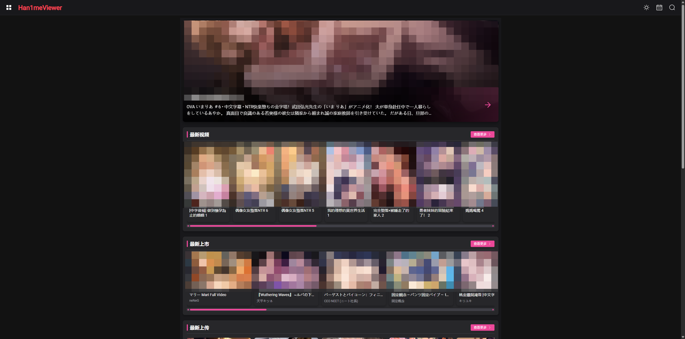
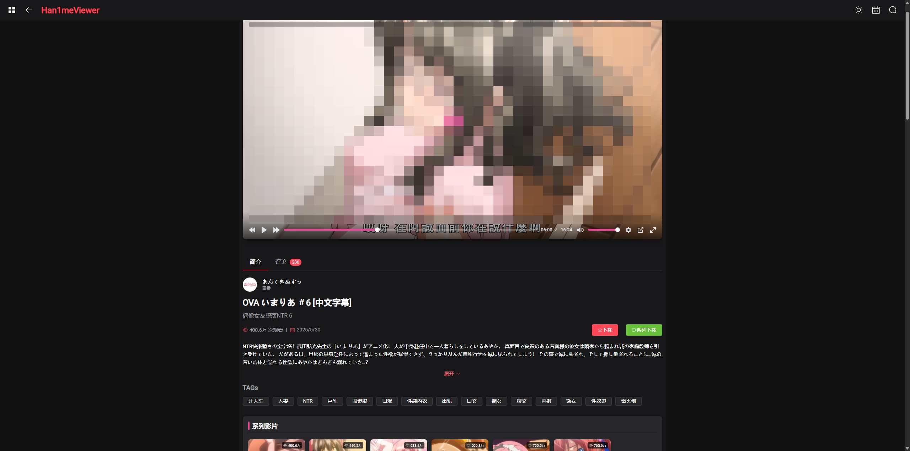
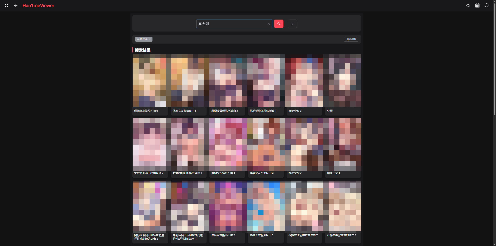
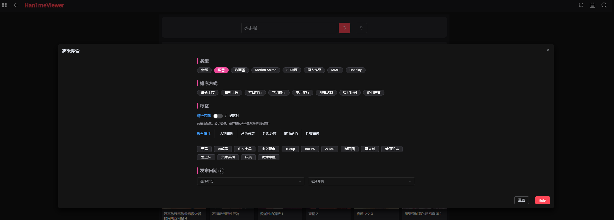
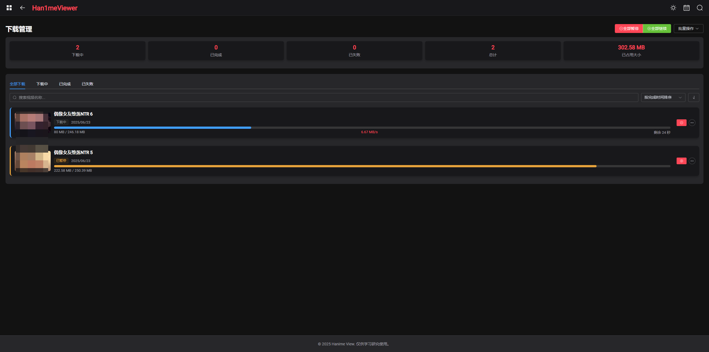
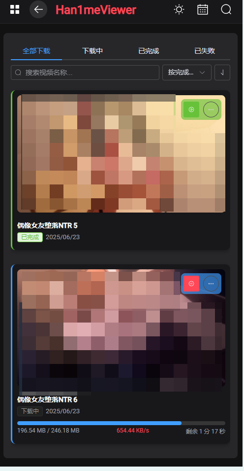

# Han1me Server

<div align="center">
  <a href="https://github.com/heisenyu/hanime-server">
    
  </a>
  <br>
  <p>🎬 强大而简洁的Han1me视频浏览与下载解决方案</p>
</div>

<p align="center">
  <a href="#-功能特色">功能特色</a> •
  <a href="#-项目截图">项目截图</a> •
  <a href="#️-技术架构">技术架构</a> •
  <a href="#-部署指南">部署指南</a> •
  <a href="#-免责声明">免责声明</a> •
  <a href="#-许可证">许可证</a>
</p>


## 📜 项目简介

Han1me Server 是一个基于 Python 和 Vue.js 开发的全栈应用，用于浏览和播放 hanime 视频资源。项目采用前后端分离架构，后端使用 FastAPI 提供 RESTful API 接口，前端使用 Vue.js 构建响应式用户界面，支持多平台访问。

整个应用通过 Docker 容器化技术实现一键部署，大大简化了安装和使用流程。适合在NAS设备（如群晖、威联通等）上部署，可作为家庭媒体服务器使用，支持远程访问和视频管理。

> **关于作者**: 作者并非Vue开发者，前端主要借助Cursor AI辅助工具进行开发，如有不足之处，敬请谅解。

> **项目灵感**: 本项目的页面布局和功能设计参考了 [YenalyLiew/Han1meViewer](https://github.com/YenalyLiew/Han1meViewer) Android端应用。由于原项目已标记为不再维护，促使我开发了这个基于Web的替代版本，让更多设备都能方便使用。本项目支持直接下载视频到NAS存储设备，便于媒体库集中管理和随时观看。

---

## ✨ 功能特色

<div align="center">
  <div style="display: flex; flex-wrap: wrap; justify-content: center; gap: 20px; margin-bottom: 30px;">
    <div style="text-align: center; width: 200px;">
      <div style="font-size: 32px;">🎬</div>
      <div><b>视频浏览</b></div>
      <div style="font-size: 14px;">首页推荐、分类浏览</div>
    </div>
    <div style="text-align: center; width: 200px;">
      <div style="font-size: 32px;">🔍</div>
      <div><b>高级搜索</b></div>
      <div style="font-size: 14px;">多条件组合查询</div>
    </div>
    <div style="text-align: center; width: 200px;">
      <div style="font-size: 32px;">🌙</div>
      <div><b>暗黑模式切换</b></div>
      <div style="font-size: 14px;">支持明暗主题切换</div>
    </div>
    <div style="text-align: center; width: 200px;">
      <div style="font-size: 32px;">📥</div>
      <div><b>下载管理</b></div>
      <div style="font-size: 14px;">批量下载与管理</div>
    </div>
    <div style="text-align: center; width: 200px;">
      <div style="font-size: 32px;">💬</div>
      <div><b>视频评论</b></div>
      <div style="font-size: 14px;">查看社区反馈</div>
    </div>
    <div style="text-align: center; width: 200px;">
      <div style="font-size: 32px;">🎮</div>
      <div><b>视频播放</b></div>
      <div style="font-size: 14px;">流畅播放体验</div>
    </div>
    <div style="text-align: center; width: 200px;">
      <div style="font-size: 32px;">📱</div>
      <div><b>响应式设计</b></div>
      <div style="font-size: 14px;">适配多种设备</div>
    </div>
    <div style="text-align: center; width: 200px;">
      <div style="font-size: 32px;">🖥️</div>
      <div><b>NAS 部署</b></div>
      <div style="font-size: 14px;">家庭媒体中心</div>
    </div>
  </div>
</div>

## 📷 项目截图

<div align="center">
  <div style="margin-bottom: 30px;">
    
    <p align="center"><b>主页</b> - 展示推荐内容和分类</p>
  </div>
  
  <div style="margin-bottom: 30px;">
    
    <p align="center"><b>视频详情页</b> - 播放器和相关信息</p>
  </div>
  
  <div style="margin-bottom: 30px;">
    
    <p align="center"><b>搜索页</b> - 快速找到想要的内容</p>
  </div>
  
  <div style="margin-bottom: 30px;">
    
    <p align="center"><b>高级搜索</b> - 多条件筛选</p>
  </div>
  
  <div style="margin-bottom: 30px;">
    
    <p align="center"><b>下载页</b> - 管理下载任务</p>
  </div>
  
  <div style="margin-bottom: 30px;">
    
    <p align="center"><b>手机端下载页示例</b> - 移动设备适配</p>
  </div>
</div>

## 🛠️ 技术架构

<div align="center">
  <table>
    <tr>
      <th>后端技术</th>
      <th>前端技术</th>
    </tr>
    <tr>
      <td>
        <ul>
          <li>Python 3.10</li>
          <li>FastAPI 框架</li>
          <li>SQLite 数据存储</li>
          <li>异步下载服务</li>
          <li>视频元数据服务</li>
          <li>Cloudflare 绕过实现</li>
          <li>LRU缓存优化</li>
        </ul>
      </td>
      <td>
        <ul>
          <li>Vue.js 框架</li>
          <li>TypeScript 类型支持</li>
          <li>Vite 构建工具</li>
          <li>Vue Router 路由管理</li>
          <li>Pinia 状态管理</li>
          <li>Plyr 视频播放器组件</li>
          <li>响应式布局设计</li>
        </ul>
      </td>
    </tr>
  </table>
</div>

### 核心组件

- **下载服务**: 管理视频下载队列、状态跟踪和错误处理
- **视频服务**: 提供视频搜索、元数据解析和内容推荐
- **数据缓存**: 优化性能和减少网络请求
- **Cloudflare绕过**: 解决访问限制问题
- **Plyr播放器**: 提供流畅的视频播放体验

## 📝 开发计划

> **当前状态**: 本项目已完成基础功能开发，包括视频浏览、搜索、播放、下载等核心功能，可以满足日常使用需求。

TODO：

- [ ] **新番列表**: 展示最新更新的内容
- [ ] **设置页面**: 用户偏好设置与系统配置
- [ ] **清单列表**: 包括稍后观看、喜欢的影片、播放清单等
- [ ] **观看历史**: 记录和管理已观看内容

> 随缘更新，有需要的话可以自行开发。欢迎提交Issue或PR！

## 🚀 部署指南

### Docker 部署（推荐）

现在可以通过 Docker Compose 一键部署整个应用：

1. 创建 `docker-compose.yml` 文件：

```yaml
version: '3'
services:
  hanime-server:
    image: heisenyu/hanime-server:latest
    environment:
      - USE_PROXY=${USE_PROXY:-true}               # 是否使用代理（国内网络必须配置）
      - PROXY_URL=${PROXY_URL:-}                    # 代理地址
      - USE_DOWNLOAD_PROXY=${USE_DOWNLOAD_PROXY:-false}  # 下载视频时是否使用代理，默认false
      - DOWNLOAD_PROXY_URL=${DOWNLOAD_PROXY_URL:-}       # 下载视频专用代理地址，未设置则使用PROXY_URL
    ports:
      - "7788:7788"                         # 前端界面端口
    volumes:
      - ./downloads:/app/backend/downloads  # 下载目录映射
      - ./db:/app/backend/db                # 元数据目录映射
    restart: unless-stopped
```

2. 代理设置说明：
   - `USE_PROXY`: 设置为 `true` 表示元数据获取使用代理（国内网络必须开启）
   - `PROXY_URL`: 代理服务器地址
   - `USE_DOWNLOAD_PROXY`: 设置为 `true` 表示下载视频时使用代理，默认为 `false`（经测试，下载视频可以不走代理）
   - `DOWNLOAD_PROXY_URL`: 下载视频专用代理地址，如不设置则使用 `PROXY_URL`

3. 运行容器：

```bash
docker-compose up -d
```

4. 访问应用：
   - 前端界面：http://localhost:7788

### NAS 部署指南

本项目适合在各类NAS系统上部署：

#### 群晖 (Synology) NAS 部署
1. 在套件中心安装Docker
2. 在Docker应用中创建上述docker-compose.yml文件
3. 映射下载目录到您的媒体文件夹

#### 威联通 (QNAP) NAS 部署
1. 通过Container Station安装
2. 使用上述docker-compose配置
3. 映射存储卷到媒体文件夹

#### 其他 NAS 系统
只要支持Docker，均可按照类似步骤进行部署

### 定制构建

如果您希望自行构建 Docker 镜像：

```bash
# 克隆仓库
git clone https://github.com/heisenyu/hanime-server
cd hanime-server

# 构建镜像
docker build -t hanime-server:custom .

# 运行容器
docker run -d -p 7788:7788 -p 8000:8000 -v $(pwd)/downloads:/app/backend/downloads hanime-server:custom
```

### 手动部署

#### 后端部署
1. 进入 backend 目录
2. 安装依赖：`pip install -r requirements.txt`
3. 运行服务器：`python main.py`

通过 http://localhost:8000/docs 访问 API 文档

#### 前端部署
1. 进入 frontend 目录
2. 安装依赖：`npm install`
3. 开发模式：`npm run dev`
4. 构建生产版：`npm run build`

通过 http://localhost:7788 访问前端页面


## 📜 免责声明

本应用程序（以下简称"本应用"）与原站点及其关联方无任何隶属、合作或授权关系，特此声明如下：

### 🔍 数据来源

本应用通过合法技术手段仅获取目标网站公开显示的信息，不涉及：

* 🔒 用户账户等隐私数据
* 🛑 网站后端数据库访问
* ⚠️ 任何形式的注入攻击

### ⚖️ 使用限制

本应用提供的所有内容仅用于：

* 📚 技术研究学习
* ✨ 用户体验优化
* 🚫 非商业用途展示

### ©️ 版权归属

原始视频/图文内容版权均归原始网站或内容制作/发行方所有，本应用:

* 💾 不存储任何版权内容（除用户主动下载）
* ✂️ 不修改原始内容
* 🏷️ 不声称拥有内容所有权

### 🛡️ 责任豁免

使用者应知晓：

* ⏳ 本应用不保证数据的完整性和实时性
* 🙅‍♂️ 使用产生的一切后果由用户自行承担
* ⛔ 不得用于非法用途

## 📄 许可证

本项目采用 Apache License Version 2.0 许可证，详细条款请参阅项目根目录下的 LICENSE 文件。

主要条款包括：
- 允许商用、修改、分发和私有使用
- 要求保留版权声明和许可证文件
- 提供修改说明（如有）
- 不提供质量担保
- 不承担用户使用风险

---

<div align="center">
  <p>ℹ️ 温馨提示：建议通过官方渠道支持原站内容，并点击广告以支持网站运营者。</p>
  <p>🌟 如果您喜欢这个项目，请考虑给它点个星！</p>
</div>